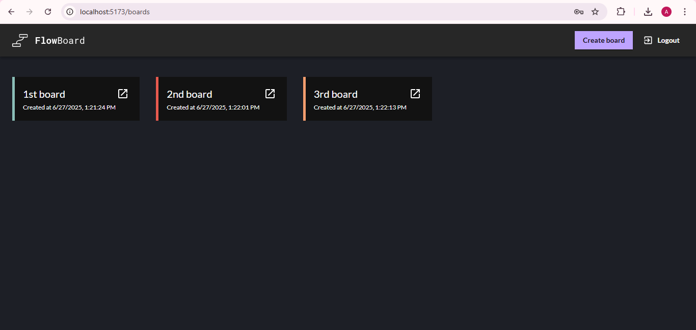
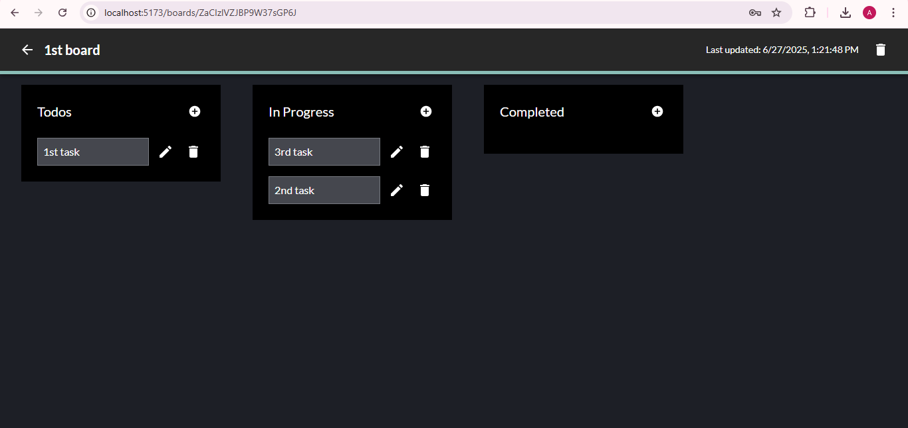
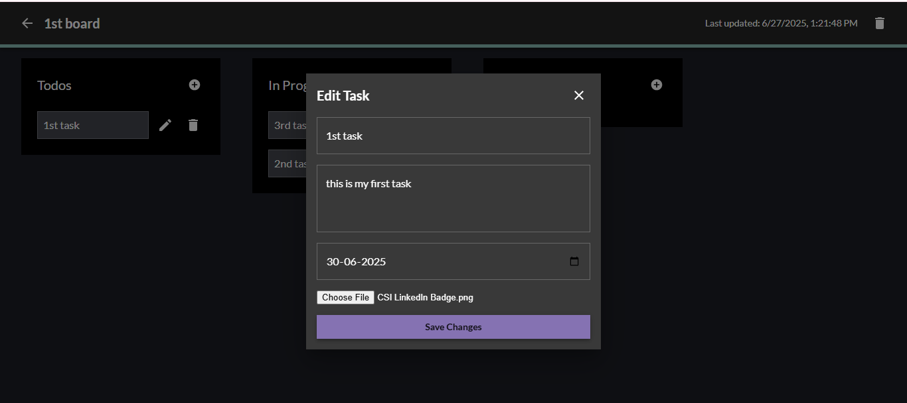

## Kanban Task Manager

A responsive and feature-rich Kanban board built with **React**, powered by **Firebase** for authentication, database, cloud functions, and file storage.

## Features

- ✅ Drag and drop tasks across columns (To Do, In Progress, Done)
- 📝 Add, edit, and delete tasks and create and delete boards
- 📅 Set due dates and add description
- 📎 File attachments using Firebase Storage
- 🔐 User authentication with Firebase Auth
- ☁️ Backend logic using Firebase Cloud Functions

---

## 🛠 Tech Stack

- **Frontend:** React (Vite), MUI (Material UI), dnd-kit and Zustand Library
- **Backend:** Firebase (Firestore, Auth, Storage, Cloud Functions)
 ## 📸 Screenshots

### 🖥️ Kanban Board



### 🗂️ Task Modal



### 🗂️ Edit Modal



## Setup Instructions

### 1. Clone and install

In the terminal:

```bash
npm install
cd functions
npm install
cd ..

### 2. Create env file
### 3. Start firebase emulators
firebase login
firebase emulators:start
### Run locally
in new terminal-
npm run dev

